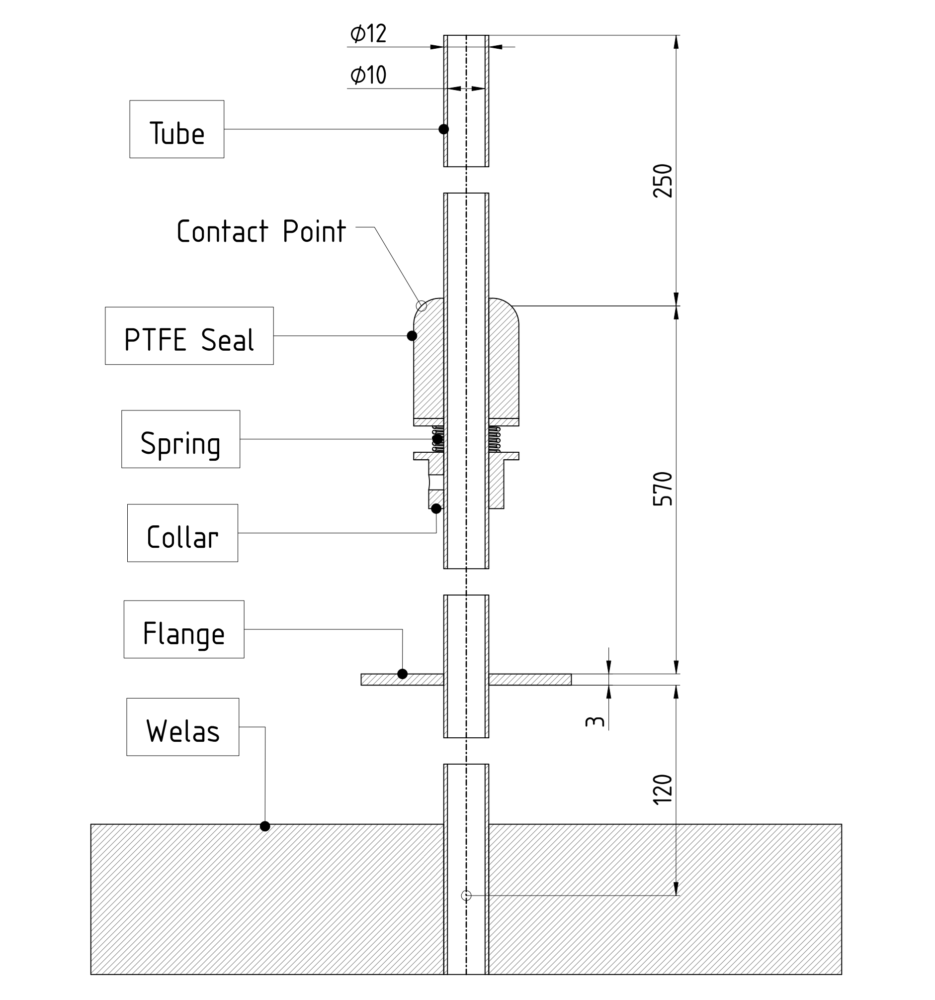

    
    In this project, we analyze a compressible airflow involving Conjugate Heat Transfer (CHT) using CFX. The study focuses on a laminar internal flow of air drawn from a cloud chamber (AIDAd) to an aerosol spectrometer (Welas), where it undergoes heating during circulation. This heating can be detrimental to water and ice particles, making it crucial to investigate. The project examines the use of thermal insulation to mitigate this effect. Heat exchange with the external air is modeled using correlations to calculate the Nusselt number, which is then employed to determine the heat transfer coefficient (h).

    

        <figure>
            
             <figcaption>Figure 1: System Setup.</figcaption>
        </figure>
    
  

<h1>Introduction</h1>

    A technical drawing is shown in Figure 1. The air flows downwards, crossing three different regions: the first, characterized by being the pipe inside an inner chamber with a temperature of -20°C and a length of 250 mm; the second, with a length of 570 mm and located in the gap between the inner and outer vessels; and the third, where the pipe extends from the external vessel to the aerosol spectrometer.

    

    <figure>
        
         <figcaption>Figure 2: Schematic section of connection system: components and dimensions.</figcaption>
    </figure>

    

    <table>
        <tablecaption>Table 1: Components and Materials List</tablecaption>
        <thead>
            <tr>
                <th>Component</th>
                <th>Material</th>
            </tr>
        </thead>
        <tbody>
            <tr>
                <td>Tube, Collar and Flange</td>
                <td>SS 304L</td>
            </tr>
            <tr>
                <td>PTFE Seal</td>
                <td>PTFE</td>
            </tr>
            <tr>
                <td>Spring</td>
                <td>---</td>
            </tr>
        </tbody>
    </table>

