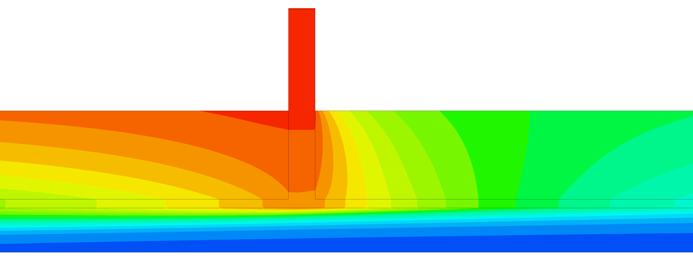

---
title: CAE/CFD Simulation Projects
---

# Computational Fluid Dynamics Projects

Welcome to my portfolio of Computational Fluid Dynamics (CFD) projects. Here, you will find detailed descriptions and results of various simulations and analyses that I have conducted.

## Featured Projects

###  [Conjugate Heat Transfer of a Compressible Fluid](CHT-CF.md)

    In this project, we analyze a compressible airflow involving Conjugate Heat Transfer (CHT) using CFX. The study focuses on a laminar internal flow of air drawn from a cloud chamber (AIDAd) to an aerosol spectrometer (Welas), where it undergoes heating during circulation. This heating can be detrimental to water and ice particles...

## About Me

I am a Mechanical Engineer specializing in CFD (Computational Fluid Dynamics) and thermohydraulics. Over the past few years, I’ve worked on a range of simulation projects, tackling complex fluid and heat transfer challenges.

On this site, you'll find a showcase of my key projects and simulations. Feel free to explore and reach out if you have any questions or opportunities for collaboration.

