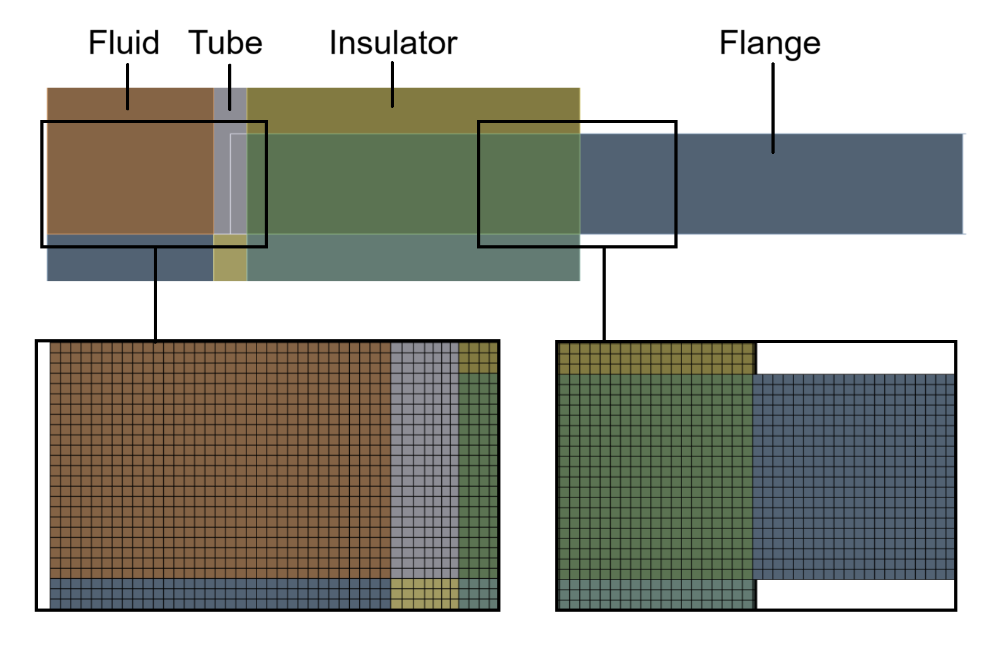

    
    In this project, we analyze a compressible airflow involving Conjugate Heat Transfer (CHT) using CFX. The study focuses on a laminar internal flow of air drawn from a cloud chamber (AIDAd) to an aerosol spectrometer (Welas), where it undergoes heating during circulation. This heating can be detrimental to water and ice particles, making it crucial to investigate. The project examines the use of thermal insulation to mitigate this effect. Heat exchange with the external air is modeled using correlations to calculate the Nusselt number, which is then employed to determine the heat transfer coefficient (h).

# Introduction

    <h1>Project 1: CFD Analysis</h1>
    <h3>A Detailed Study of Fluid Dynamics</h3>
    

        
    

    This project investigates the following equation:

$ \frac{a}{b} = c $

MathML:
<math xmlns="http://www.w3.org/1998/Math/MathML">
  <msup>
    <mi>x</mi>
    <mn>2</mn>
  </msup>
</math>

HTML Entities:

For example: &alpha; + &beta; = &gamma;

Unicode Characters:
a² + b² = c²

$$
    \begin{array}{|c|c|c|}
    \hline
    \text{Column 1} & \text{Column 2} & \text{Column 3} \\
    \hline
    \text{Row 1} & \text{Data} & \text{More Data} \\
    \text{Row 2} & \text{Data} & \text{More Data} \\
    \hline
    \end{array}
$$

| Symbol  | Description |
|---------|-------------|
| $\alpha$| Alpha       |
| $\beta$ | Beta        |
| $\gamma$| Gamma       |

<table>
  <thead>
    <tr>
      <th>Symbol</th>
      <th>Description</th>
    </tr>
  </thead>
  <tbody>
    <tr>
      <td>\(\alpha\)</td>
      <td>Alpha</td>
    </tr>
    <tr>
      <td>\(\beta\)</td>
      <td>Beta</td>
    </tr>
    <tr>
      <td>\(\gamma\)</td>
      <td>Gamma</td>
    </tr>
  </tbody>
</table>

$$
    \begin{array}{|l|l|}
    \hline
    \textbf{Component}         & \textbf{Material}     \\
    \hline
    Tube, Collar and Flange    & SS 304L               \\
    \hline
    PTFE Seal                  & PTFE                  \\
    \hline
    Spring                     & ---                   \\
    \hline
    \end{array}
$$
